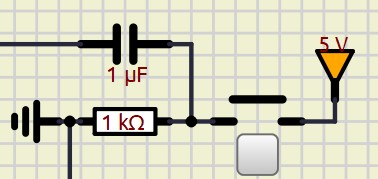
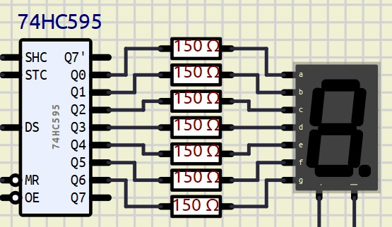

# Simon
Recriado o brinquedo [Simon](https://en.wikipedia.org/wiki/Simon_(game)) utilizando o microcontrolador PIC16F48.

## Descrição
Utilzando do microcontrolador PIC16F84, foi desenvolvido um programa para emular o conceito básico de um Simon, que consiste em repetir a sequencai de luzes piscantes apresentadas pelo sistema.

O programa foi desenvolvido em C, utilizando da extenão [MPLAB para Visual Studio Code](https://marketplace.visualstudio.com/items?itemName=Microchip.mplab-extension-pack). Foi seguido os padrões requisitados pelo compilador da mesma.

O circuito foi emulado e desenvolvido no [SimulIDE](https://simulide.com/p/), onde podepos emular varios microcontroladores e componentes eletronicos.

### Desmonstração

[Video no YouTube](https://www.youtube.com/shorts/OvKHHk_A2M8)

Para simular o circuito, é necessario carregar o arquivo *Simon.sim1*, econtrado na pasta */circuito* no *SimulIDE* e carregar o arquivo *Simon_default_default.hex* encontrado no caminho */_build/Simon/default*  como *firmware* no PIC16F48.

### Dificuldades
- **Debounce**

    Quando trabalhamos com entradas por componentens fisicos que serão usados por usuários comuns temos que tratar ruidos, e a tequinica de *debounce* trata destes problemas.  
    Ela consiste em criar um atraso artificial para termos certeza que o valor lido é verdadeiro e não um ruido. A abordagem escolhida foi de *debounce* fisico, por deixar o código mais limpo e se necessário altera-lo, só precisamos trocar o componente.

    

    Esse circuito gera um *debounce* de 10ms. Que se enquandra em uma quantidade aceitavel de tempo, não cendo percepitivel o atraso ao usuário.

- **Display de 7 segmentos**

    Para indicar os valores no display de 7 segmentos foi utilizado um conversor de serial para paralelo, neste caso o 74HC545 foi ecolido.  
    
    A sequencia de LEDs do diplay a ser acesa é passada para o 74HC545 de modo serial e o mesmo converte os dados para paralelo.
    Em código a sequencia é representada por um Byte onde o digito menos seguinificativo é ignorado, logo a relação de bit para led é:
    ```
    bit:   7 6 5 4 3 2 1 0 
    Led:   a b c d e f g - 
    ```
    Para representarmos a letra 'A', passariamos a o Byte '0b11101110' para o função *to_paralel()* encarregada do 74HC545.

    ```C
    #define DELAY 1

    void to_paralel(char bits){
        unsigned char i;
        for(i = 0; i < 8; i++){
            // Passa por cada bit
            DATA = (bits & (1<<i)) ? 1 : 0;
            // Pulsa o clock
            CLK = 1;
            __delay_ms(DELAY);
            CLK = 0;
            __delay_ms(DELAY);
        }
        // Pulsa o LATCH
        LATCH = 1;
        __delay_ms(DELAY);
        LATCH = 0;
        __delay_ms(DELAY);
    }
    ```
    Para o 74HC545, cada pulso de *clock* (*SHC* no circuito) tranfere o valor de DATA (*DS* do circuito) para um *buffer* interno do 74HC545, e quando pulsamos o *latch* (*STC* no circuito) indicamos a transmição de dados foi terminada e os daddos do *buffer* são passados para as porta *Q0* até *Q7*.

## Possiveis modificações

Após a conclusão do projeto, foi identifcado duas situação que podiam ter cido abordadas de modo diferente.

1. **Armazenamento da sequencia**
    A sequencia de LEDs que serão piscados foi armazenada em um array, poderia ter cido aramazenado utilizando de 1 Byte.
    Onde os bits 3-0 poderiam representar cada LED, ocupando assim menos espaço na mimemoria do microcontrolador.
    Teriamos que alterar a geração das novas sequencias e a verificação da sequancia do usuário.
2. **1 pino para todos os LEDs**
    Na configuração atual, cada LED se conecta diretamente com um pino do microcontrolador, onde acabamos com a Porta B dedicada as LEDS e os Botões.
    Se utilizacemos de um conversor de serial para paralelo, poderiamos dedicar apenas 3 pinos para os LEDs, ou apenas 1 para o *latch* e utilizar o mesmo pino de *DATA* e *clock* já vistos a cima.
    Assim diminuindo o uso de pinos, abrindo a pocibilidade para outros componentes e funcionalidades.
